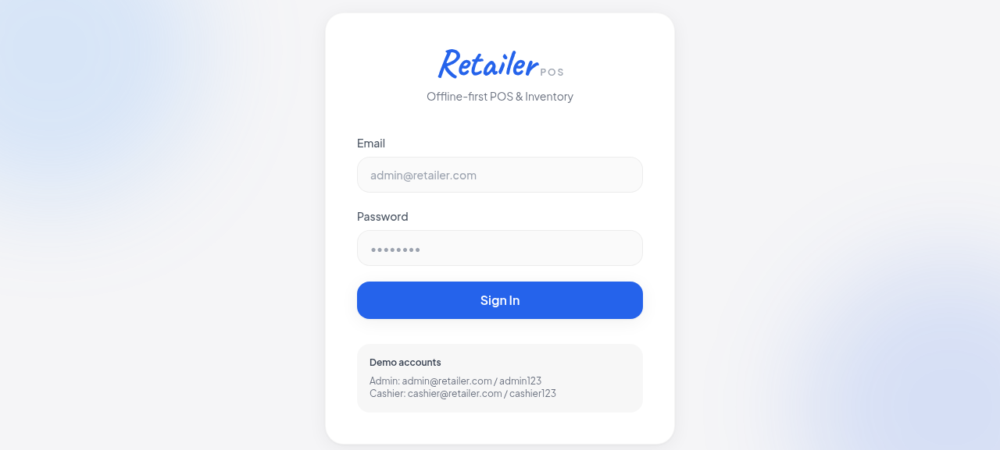
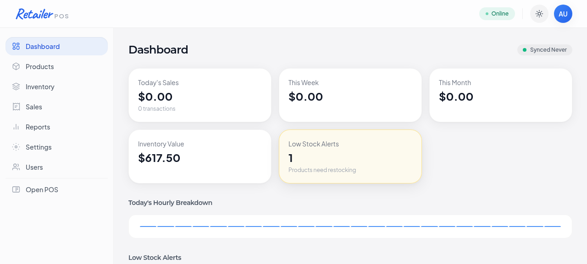
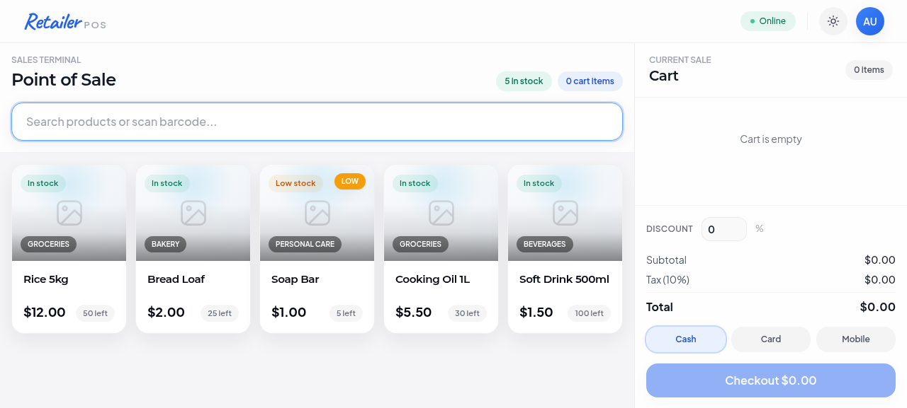
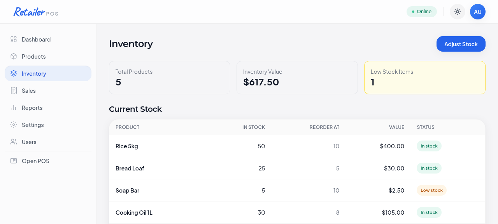
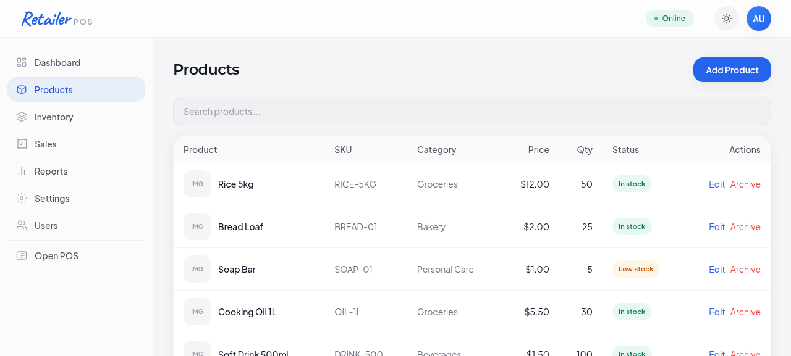
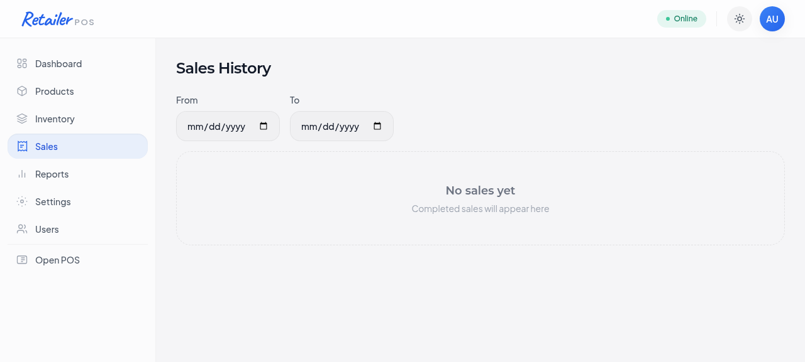
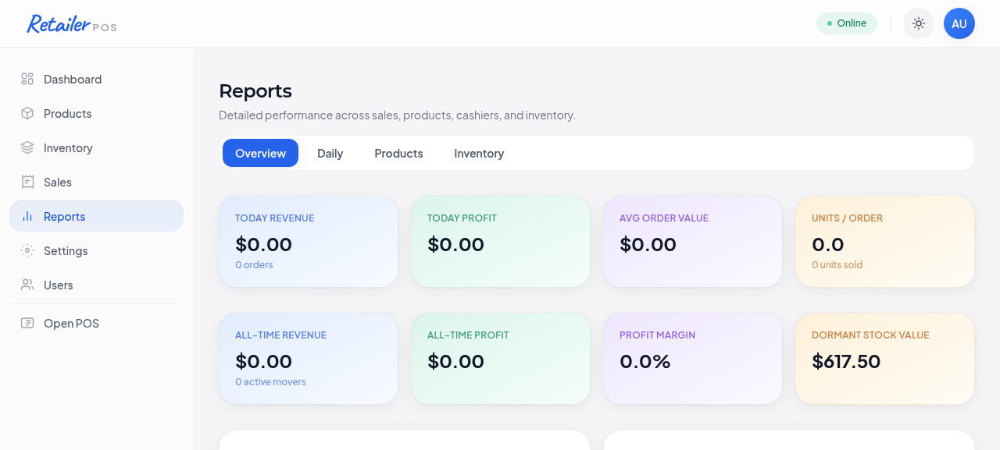

# Retailer-POS: Visual Feature Guide

**Production-Ready Offline-First Point of Sale & Inventory Management System**

A modern, fully-featured retail management platform built with React and Vite. Engineered for offline-first operation with real-time cloud synchronization, barcode integration, and enterprise-grade security.

---

## 📋 Table of Contents

- [Authentication](#authentication)
- [Dashboard](#dashboard)  
- [Point of Sale (POS)](#point-of-sale-pos)
- [Inventory Management](#inventory-management)
- [Product Catalog](#product-catalog)
- [Sales History](#sales-history)
- [Business Analytics](#business-analytics)
- [v1.0.1 Features](#v101-features)

---

## Authentication

### Secure Login Interface

**Authentication Features:**
- Industry-standard secure authentication
- Email/password validation with rate limiting
- Session management with encrypted tokens
- Role-based access control (Admin, Cashier)
- Account recovery mechanisms

**Demo Credentials for Testing:**

| Role | Email | Password |
|------|-------|----------|
| **Administrator** | `admin@retailer.com` | `admin123` |
| **Cashier** | `cashier@retailer.com` | `cashier123` |

**Security Highlights:**
- Passwords hashed with industry-standard algorithms
- CSRF protection on all forms
- SQL injection prevention via parameterized queries
- Session timeout protection
- Login attempt rate limiting (5 attempts per 5 minutes)

---

## Dashboard

### Real-Time Business Intelligence Center

**Dashboard Metrics at a Glance:**

| Metric | Value | Refresh Rate |
|--------|-------|--------------|
| **Today's Sales** | Live transaction count & revenue | Real-time |
| **Weekly Total** | Last 7 days cumulative sales | Auto-updated |
| **Monthly Total** | Current month revenue | Auto-updated |
| **Inventory Value** | Total stock valuation | Hourly |
| **Low Stock Alerts** | Count of products below reorder point | Real-time |

**Advanced Features:**

### 🔔 Real-Time Alert System
- **Low Stock Notifications:** Automatic detection when inventory falls below reorder level
- **Click-Through Actions:** Jump directly to inventory management for affected products
- **Visual Indicators:** Color-coded warnings for critical stock levels
- **Bulk Operations:** Handle multiple low-stock items simultaneously

### 📈 Hourly Sales Analytics
- **Sparkline Visualization:** Minute-by-minute sales breakdown for current day
- **Peak Hour Identification:** Identify traffic patterns for staffing optimization
- **Promotional Timing:** Data-driven insights for time-sensitive offers
- **Historical Trends:** Compare performance across previous days

### 🔄 Sync Status Indicator
- **Last Sync Timestamp:** Shows when data was successfully synced to cloud
- **Connection Status:** Real-time online/offline indicator
- **Sync Queue:** Visual indicator of pending transactions
- **Conflict Resolution:** Automatic handling of sync conflicts

### ⚡ Performance Optimizations
- **Skeleton Loaders:** Perceived performance improvements during data loading
- **Auto-Refresh:** Dashboard updates automatically at configurable intervals
- **Lazy Loading:** Efficient data loading for large datasets
- **Caching Layer:** Smart caching prevents unnecessary API calls

---

## Point of Sale (POS)

### Complete Transaction Management System

**Core POS Capabilities:**

### 🔍 Intelligent Product Discovery

**Barcode Scanning & Search:**
- **Barcode Lookup API Integration:** Access external product database for items not in local system
- **Smart Caching:** 7-day local cache reduces external API calls
- **Rate Limiting:** 10 lookups/minute prevents API abuse
- **Fallback Mechanism:** Seamless transition to manual search if API unavailable
- **Barcode Formats Supported:** UPC-A, EAN-13, Code 128, QR codes

**Product Catalog Display:**
- **Grid Layout:** Visual product browsing with thumbnail images
- **Real-Time Inventory Status:**
  - ✅ In Stock (available for immediate sale)
  - ⚠️ Low Stock (limited quantity available)
  - ❌ Out of Stock (auto-hidden from POS view)
- **Dynamic Pricing:** Live price updates from product database
- **Category Organization:** Grouping by Groceries, Bakery, Electronics, etc.

### 🛒 Advanced Cart Management

**Real-Time Cart Operations:**
- **Quantity Adjustment:** Instant total recalculation on quantity changes
- **Multi-Item Transactions:** Support for hundreds of items per transaction
- **Void Items:** Remove incorrect items from cart with reason tracking
- **Cart History:** Recent transactions available for quick reorders

**Discount Application:**
- **Percentage Discounts:** Apply 5%, 10%, 15% store-wide discounts
- **Fixed Amount Discounts:** Reduce total by specific dollar amounts
- **Coupon Codes:** Support for promotional codes and loyalty discounts
- **Manual Overrides:** Manager-approved price adjustments with audit trail

**Tax Calculation:**
- **Configurable Tax Rates:** Per-region tax rate configuration
- **Automatic Calculation:** Tax applied automatically based on items
- **Tax-Exempt Items:** Support for non-taxable products
- **Tax Summary:** Clear breakdown of tax components on receipt

### 💳 Checkout & Payment Processing

**Payment Methods:**
- **Cash:** Traditional cash transactions with change calculation
- **Card:** Credit/debit card with PCI compliance
- **Mobile Payment:** Apple Pay, Google Pay, mobile wallets
- **Check:** Checkbook support with clearing timeline

**Transaction Safety:**
- **Duplicate Prevention:** Idempotency keys prevent double-charges
- **Client-Side Validation:** Loading states prevent accidental re-submission
- **Server-Side Deduplication:** 10-second transaction window for safety
- **Receipt Generation:** Automatic thermal printer and email receipt support

**Advanced Features:**
- **Partial Payments:** Split transactions across multiple payment methods
- **Gift Cards:** Support for store gift cards and store credit
- **Refunds:** Quick refund processing with original receipt linking
- **Layaway:** Payment plan support for large purchases

---

## Inventory Management

### Complete Stock Control System

**Inventory Overview:**

| Component | Functionality |
|-----------|--------------|
| **Product Count** | Total number of SKUs in system |
| **Inventory Value** | Total dollar value of all stock |
| **Low Stock Count** | Number of items below reorder threshold |
| **Stock Status** | Visual health indicator (Good, Warning, Critical) |

**Stock Tracking Table:**

| Column | Purpose | Example |
|--------|---------|---------|
| **Product Name** | Item identifier with category icon | Organic Milk |
| **In Stock** | Current quantity on hand | 45 units |
| **Reorder At** | Automatic reorder level trigger | 20 units |
| **Stock Value** | Total $ value of item (Qty × Cost) | $180.00 |
| **Status Indicator** | Visual stock health (🟢 Good / 🟡 Low / 🔴 Critical) | 🟡 Low Stock |
| **Actions** | Adjust, View History, Create PO | [Buttons] |

**Inventory Operations:**

### 📦 Stock Adjustments
- **Manual Adjustments:** Correct inventory discrepancies with reason codes
- **Receiving Shipments:** Batch add new inventory from suppliers
- **Physical Counts:** Cycle counting and physical verification
- **Adjustment History:** Complete audit trail of all changes

### 📊 Stock Analytics
- **Turnover Rate:** Days of supply calculation per item
- **Slow Movers:** Items with minimal sales activity
- **Stock Valuation:** FIFO/LIFO costing methods
- **Aging Report:** Identify obsolete or expired stock

### ⚙️ Automation
- **Automatic Reorder Alerts:** Flag items below reorder point
- **Min/Max Rules:** Maintain optimal stock levels automatically
- **Purchase Order Generation:** Create supplier POs automatically
- **Expiration Tracking:** FIFO enforcement for perishables

---

## Product Catalog

### Enterprise Product Management

**Product Database Management:**

| Column | Purpose | Data Type |
|--------|---------|-----------|
| **Product Name** | Item name with image thumbnail | Text (100 chars) |
| **SKU** | Barcode/unique identifier for scanning | Alphanumeric (20 chars) |
| **Category** | Product classification/grouping | Dropdown selector |
| **Selling Price** | Customer facing price per unit | Currency |
| **Current Stock** | Real-time inventory level | Integer |
| **Reorder Level** | Auto-alert threshold | Integer |
| **Status** | Availability status | In Stock / Low / Out |
| **Actions** | Operations (Edit, Archive, Duplicate) | Button group |

**Product Operations:**

### ✏️ Product Administration
- **Create Products:** Add new items with complete details
- **Edit Products:** Update pricing, categories, descriptions
- **Duplicate Products:** Clone similar products for faster entry
- **Archive Products:** Soft-delete keeps sales history intact
- **Bulk Import:** CSV import for rapid catalog setup

**Product Details:**
- **Complete Information:**
  - Display name and description
  - Manufacturer and supplier info
  - Cost and selling price
  - Weight and dimensions
  - Barcode and SKU
  - Image upload with optimization

- **Categorization:**
  - Primary category assignment
  - Sub-categories for organization
  - Tags for advanced filtering
  - Searchable product attributes

**Advanced Features:**
- **Product Variants:** Sizes, colors, models as single SKU
- **Supplier Management:** Link products to suppliers
- **Pricing Tiers:** Bulk pricing and wholesale support
- **Product Images:** Multiple photos per product with zoom

---

## Sales History

### Complete Transaction Audit Trail

**Historical Analysis:**

**Table Columns:**

| Column | Content | Usage |
|--------|---------|-------|
| **Date** | Transaction date & time | Filtering/Sorting |
| **Invoice #** | Unique transaction ID | Quick lookup |
| **Items** | Product count in transaction | Basket size analysis |
| **Subtotal** | Pre-tax transaction total | Revenue tracking |
| **Tax** | Sales tax collected | Compliance reporting |
| **Total** | Final amount paid | Revenue analysis |
| **Payment** | Payment method used | Payment analysis |
| **Actions** | Reprint, Details, Refund | Operations |

**Sales Filtering:**
- **Date Range:** From/To date range selection
- **Payment Method:** Filter by cash, card, mobile
- **Amount Range:** Find transactions by value
- **Cashier:** Filter by staff member
- **Status:** Completed, Voided, Refunded transactions

**Advanced Features:**
- **Search Functionality:** By invoice number or customer
- **Export Options:** CSV, PDF, Excel formats
- **Transaction Details:** Itemized receipt view
- **Refund Processing:** Issue full or partial refunds
- **Receipt Reprint:** Thermal or digital receipt output

---

## Business Analytics

### Comprehensive Reporting Dashboard

**Report Tabs:**

### 📊 Overview Dashboard
**Real-Time Summary Metrics:**

| KPI | Definition | Importance |
|-----|-----------|-----------|
| **Today Revenue** | Current day sales total | Daily cash flow |
| **Today Profit** | Revenue minus COGS | Margin analysis |
| **Avg Order Value** | Average transaction amount | Ticket sizing |
| **Units/Order** | Average items per transaction | Basket analysis |
| **Transactions** | Count of sales today | Volume metrics |
| **Avg Item Price** | Mean product price | Price optimization |

### 📅 Daily Performance
- **Day-by-Day Breakdown:** Individual day performance
- **Trend Comparison:** Compare to previous weeks/months
- **Best Performing Days:** Identify patterns
- **Growth Tracking:** Month-over-month improvement

### 📈 Product Analytics
- **Top Sellers:** Best performing products by volume
- **Profit Leaders:** Highest margin products
- **Slow Movers:** Low-performing SKUs
- **New Products:** Recently added item performance

### 📦 Inventory Insights
- **Stock Movements:** Units sold per product
- **Turnover Ratio:** Inventory efficiency metrics
- **Valuation:** Current stock dollar value
- **Dormant Stock:** Non-moving inventory analysis

**Historical Metrics:**

| Metric | Current Period | YTD | All-Time |
|--------|----------------|-----|----------|
| **Revenue** | Realized sales | Year-to-date | Total history |
| **Profit** | Net margin | YTD margin | Historical profit |
| **Margin %** | Profit margin % | YTD margin % | Average margin |
| **Units Sold** | Item count | YTD volume | Total volume |
| **Transactions** | Count | YTD count | Total count |

**Advanced Reporting:**
- **Customizable Date Ranges:** Any period analysis
- **Export Functionality:** CSV, PDF, Excel formats
- **Email Reports:** Scheduled automated reports
- **Trend Analysis:** Growth and decline patterns
- **Forecasting:** Predictive analytics for planning

---

## v1.0.1: Production Features

### 🎯 Major Enhancements

#### 🔔 **Dashboard Alerts System**
- **Real-Time Notifications:** Low-stock alerts update in real-time
- **Smart Grouping:** Multiple low-stock items shown together
- **Action Items:** Click to directly manage affected inventory
- **Historical Tracking:** Track what was alerted and when
- **Configurable Thresholds:** Per-product reorder point settings

#### 📱 **Barcode Lookup API**
- **External Database Integration:** Access to millions of product barcodes
- **Smart Local Cache:** 7-day cache reduces external API calls
- **Graceful Degradation:** Works offline with fallback to manual entry
- **Rate Protection:** 5 lookups/minute prevents abuse
- **Error Handling:** User-friendly messages for lookup failures

#### 🔒 **Duplicate Transaction Prevention**
- **Client-Side Guards:** Disabled submit prevents double-clicks
- **Idempotency Keys:** Unique transaction fingerprints
- **Server Deduplication:** 10-second window catches network retries
- **Automatic Cleanup:** Old entries removed every minute
- **Audit Trail:** Track prevented duplicates

#### ⚡ **API Rate Limiting**
- **Sync Endpoint:** 50 requests/minute per user
- **Barcode Endpoint:** 10 requests/minute per user
- **Graceful Degradation:** 429 responses with Retry-After headers
- **Per-User Tracking:** Fair usage across multiple terminals
- **Automatic Backoff:** Client-side retry with exponential backoff

---

## 🏗️ Technical Stack

**Frontend Architecture:**
- React 18 with Hooks & Context API
- Vite build tool (3-second cold start)
- Tailwind CSS for responsive design
- IndexedDB for offline-first storage
- SWR for intelligent data fetching
- localStorage for session management

**Backend Infrastructure:**
- Express.js REST API
- SQLite local database
- Supabase cloud sync (optional)
- Rate limiting middleware
- Transaction deduplication service
- CORS security headers

**DevOps & Deployment:**
- Vercel hosting (auto-scaling)
- GitHub integration (CI/CD)
- Zero-downtime deployments
- Production analytics & monitoring
- Automated SSL/TLS certificates

---

## 🚀 Quick Start Guide

### 1. **Access the Application**
   - Navigate to production deployment URL
   - Use demo credentials to sign in

### 2. **Explore POS Terminal**
   - Click "Open POS" from dashboard
   - Try barcode scanning (test with any UPC)
   - Add items to cart and complete transaction

### 3. **Manage Inventory**
   - Access Inventory menu from dashboard
   - View all products and stock levels
   - Make manual adjustments as needed

### 4. **Review Reports**
   - Go to Reports section
   - Explore dashboard and daily/product tabs
   - Export data for external analysis

### 5. **Configure Settings**
   - Access Settings from admin menu
   - Set business name, tax rate, currency
   - Configure barcode API (if using external service)

---

## 📚 Documentation

| Document | Purpose |
|----------|---------|
| [**SUPABASE_SETUP.md**](../SUPABASE_SETUP.md) | Cloud backend configuration with SQL schema and conflict resolution |
| [**ADMIN_FEATURES.md**](../ADMIN_FEATURES.md) | Complete admin reference guide for all features |
| [**RATE_LIMITING.md**](../RATE_LIMITING.md) | API protection policies, retry strategies, and monitoring |
| [**README.md**](../../README.md) | Main project overview and installation |

---

## 🔐 Security & Compliance

- **Data Encryption:** AES-256 for sensitive data at rest
- **Transport Security:** TLS 1.3 for all data in transit
- **SQL Injection Prevention:** Parameterized queries throughout
- **CSRF Protection:** Token-based cross-site request forgery prevention
- **Rate Limiting:** Prevents brute force and DoS attacks
- **Audit Logging:** Complete transaction history and access logs
- **Role-Based Access:** Admin and Cashier permission separation

---

## 💡 Tips for Best Performance

1. **Offline-First Workflow:** App operates fully offline; sync happens automatically
2. **Barcode Scanning:** Use barcode scanner device for fastest POS entry
3. **Batch Operations:** Use bulk import for product catalog setup
4. **Regular Sync:** Ensure internet connectivity for automatic cloud backup
5. **Export Data:** Regularly export reports for external accounting systems

---

**Retailer-POS v1.0.1 | Production Ready | Enterprise Grade**

For support and additional information, refer to the main [README](../../README.md) or contact development team.
